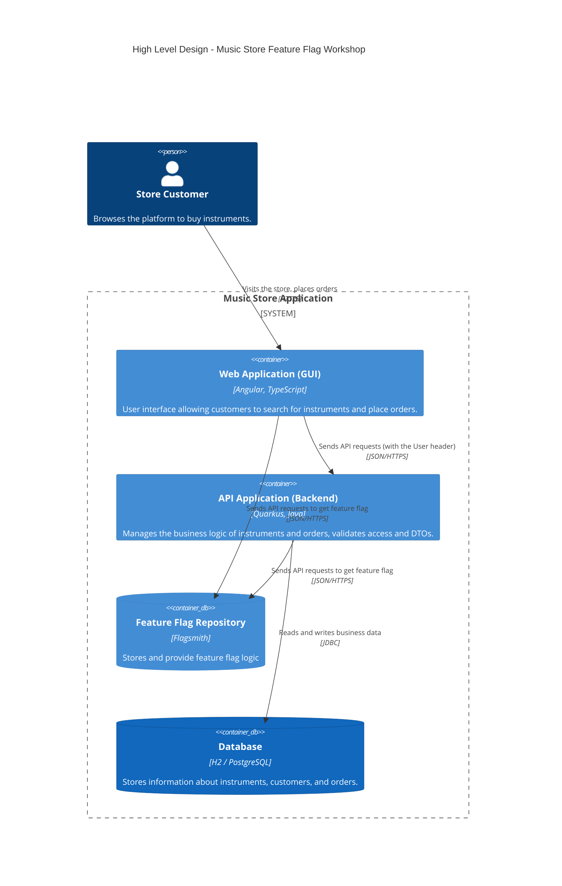

# Feature-Flag Workshop

## Introduction

This workshop aims to:

- Look into the concepts of **Feature Flags** (or Feature Toggles) and their benefits with [OpenFeature](https://openfeature.dev/).
- Present methodologies and tools that can be used to streamline the development process using feature flags.
- Pinpoint common pitfalls when using Feature Flags and how to avoid/leverage them.

During this workshop we will use different tools, practices, and languages:

* [Java](https://www.java.com/) & [Quarkus](https://quarkus.io/) as the backend platform and programming language.
* [Angular](https://angular.dev/) & [TypeScript](https://www.typescriptlang.org/) for the Frontend interface.
* **Feature Flagging platforms** (like OpenFeature providers) to control features dynamically.

### Getting involved?

The source code is available on [GitHub](https://github.com/alexandre-touret/feature-flag-workshop/).

Feel free to raise [any issues](https://github.com/alexandre-touret/feature-flag-workshop/issues) or participate if you want!

## Overview

### Main functionalities

This platform is a Music Store. It exposes a set of APIs and a Web interface providing the following functionalities:

#### Instrument management

Handle the catalog of music instruments. The data is stored into an H2 database (or PostgreSQL in production) and exposed through the following API:

* ``GET /instruments`` : Fetches all the instruments
* ``POST /instruments``: Creates a new instrument
* ``PUT /instruments/{instrumentId}``: Updates one instrument
* ``GET /instruments/{instrumentId}``: Gets one instrument
* ``DELETE /instruments/{instrumentId}``: Removes one instrument
* ``GET /instruments/search?q={query}``: Searches for instruments

Here is a sample of one instrument entity:

```json
{
  "id": 1,
  "name": "Stratocaster",
  "reference": "FEN-STR-01",
  "manufacturer": "Fender",
  "price": 1200.0,
  "description": "Classic Stratocaster",
  "type": "GUITAR"
}
```

#### Orders management

Customers can create an order containing one or many instruments.

The data is stored into the database and exposed through the following API:

* ``GET /orders`` : Fetches all the orders
* ``POST /orders``: Creates an order
* ``PUT /orders/{orderId}``: Update one order
* ``GET /orders/{orderId}``: Gets one order
* ``DELETE /orders/{orderId}``: Removes one order
* ``GET /orders/search?q={query}``: Searches for orders

Here is a sample of one order entity:

```json
{
  "orderId": "a0000000-0000-0000-0000-000000000001",
  "instruments": [
    {
      "id": 1,
      "name": "Stratocaster",
      "reference": "FEN-STR-01",
      "manufacturer": "Fender",
      "price": 1200.0,
      "description": "Classic Stratocaster",
      "type": "GUITAR"
    }
  ],
  "orderDate": "2024-03-10T12:15:50-04:00",
  "customer": {
    "firstname": "Alice",
    "lastname": "Smith",
    "email": "alice@test.com",
    "address": {
      "streetNumber": "10",
      "streetName": "Rue de Paris",
      "city": "Paris",
      "zipCode": "75001",
      "country": "France"
    }
  },
  "status": "CREATED"
}
```

### High level design

#### Context View



#### Structure of the backend

The backend business logic is implemented in a monolithic application built on a _light_ [Hexagonal Architecture way](https://en.wikipedia.org/wiki/Hexagonal_architecture_(software)).

To cut a long story short, here is a short explanation of the Java packaging:

1. The API endpoints and DTOs are located in the ``info.touret.musicstore.application``

```shell
src/main/java/info/touret/musicstore/application/
├── data
│   ├── AddressDto.java
│   ├── CustomerDto.java
│   ├── InstrumentDto.java
│   ├── InstrumentTypeDto.java
│   ├── OrderDto.java
│   ├── OrderStatusDto.java
│   └── UserDto.java
├── mapper
│   ├── InstrumentMapper.java
│   └── OrderMapper.java
├── resource
│   ├── AbstractMusicStoreResource.java
│   ├── InstrumentResource.java
│   └── OrderResource.java
├── ExceptionPostProcessor.java
└── Filters.java
```

2. The business logic and interfaces are implemented in the ``info.touret.musicstore.domain``

```shell
src/main/java/info/touret/musicstore/domain/
├── model
│   ├── Address.java
│   ├── Customer.java
│   ├── DomainError.java
│   ├── Instrument.java
│   ├── InstrumentType.java
│   ├── Order.java
│   ├── OrderStatus.java
│   └── Result.java
├── port
│   ├── InstrumentPort.java
│   └── OrderPort.java
└── service
    ├── InstrumentService.java
    └── OrderService.java
```

3. The connection to the database (the concrete adapters) is implemented in the ``info.touret.musicstore.infrastructure``

```shell
src/main/java/info/touret/musicstore/infrastructure/
└── database
    ├── adapter
    │   ├── InstrumentPanacheAdapter.java
    │   └── OrderPanacheAdapter.java
    ├── entity
    │   ├── InstrumentEntity.java
    │   ├── InstrumentTypeEntity.java
    │   ├── OrderEntity.java
    │   └── OrderStatusEntity.java
    └── mapper
        ├── InstrumentEntityMapper.java
        └── OrderEntityMapper.java
```

#### Structure of the frontend

The Web Application is built with Angular and is structured to communicate with the Quarkus Backend.

```shell
src/app/
├── components
│   ├── header
│   │   └── header.component.ts
│   ├── loader
│   │   └── loader.component.ts
│   └── user-profile
│       └── user-profile.component.ts
├── dialogs
│   └── order-dialog
│       └── order-dialog.component.ts
├── guards
│   └── auth.guard.ts
├── interceptors
│   └── user.interceptor.ts
├── models
│   ├── address.model.ts
│   ├── customer.model.ts
│   ├── instrument-type.enum.ts
│   ├── instrument.model.ts
│   ├── order-status.enum.ts
│   ├── order.model.ts
│   └── user.model.ts
├── pages
│   ├── catalog
│   │   └── catalog.component.ts
│   ├── instrument-details
│   │   └── instrument-details.component.ts
│   └── order-success
│       └── order-success.component.ts
├── services
│   ├── instrument.service.ts
│   ├── order.service.ts
│   └── user.service.ts
├── app.component.ts
├── app.config.ts
└── app.routes.ts
```

- **Models**: Interfaces & Enums representing the business objects (Customer, Instrument, Order...).
- **Services**: Handle the API calls to the backend using `HttpClient`.
- **Interceptors**: Middleware appending the `User` header to backend requests using the selected persona context.
- **Pages / Components**: Smart and dumb components to handle the UI routing and state presentation.
