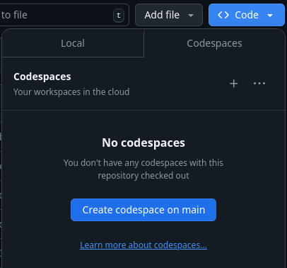
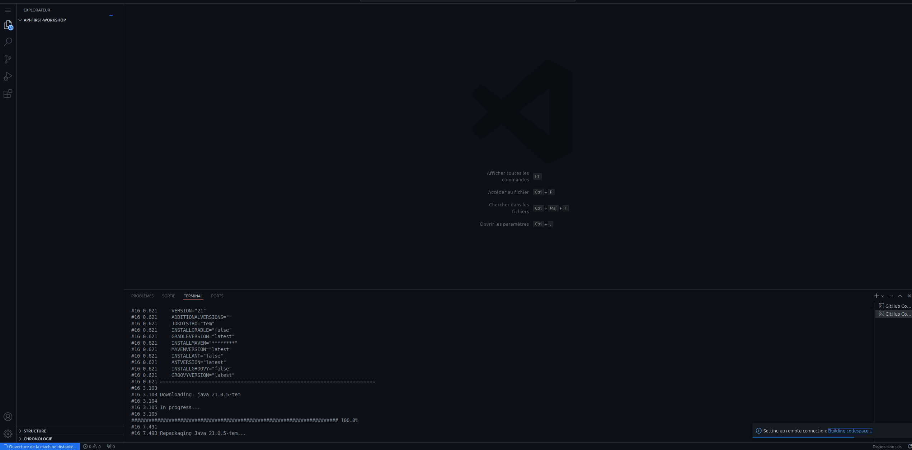
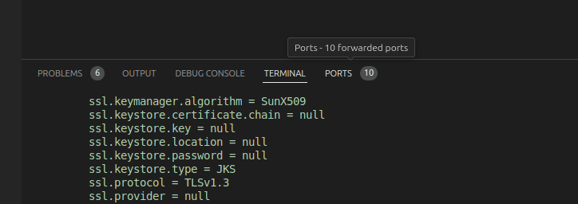
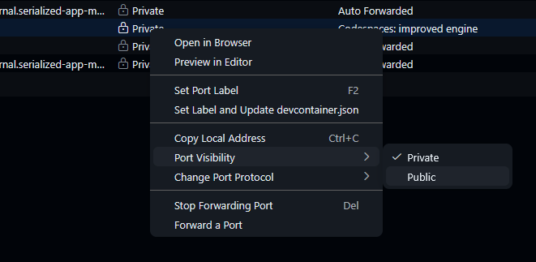
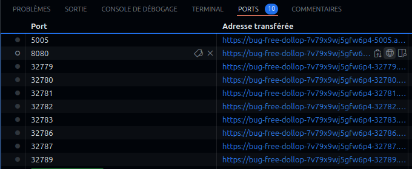
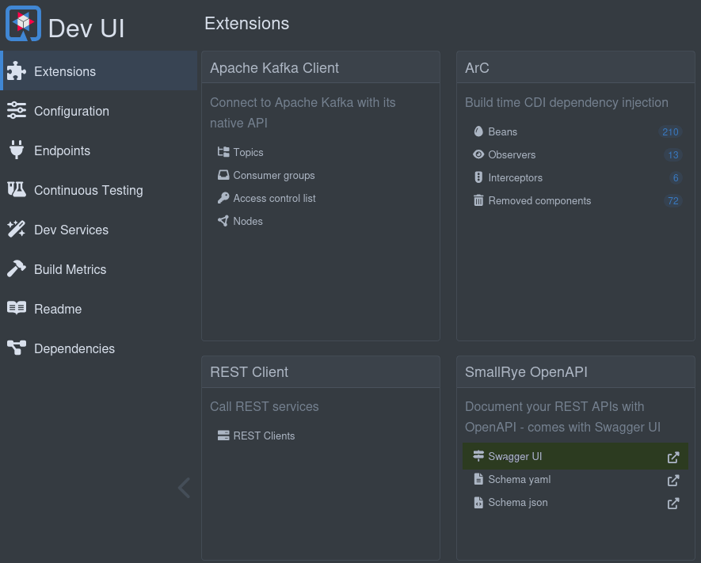
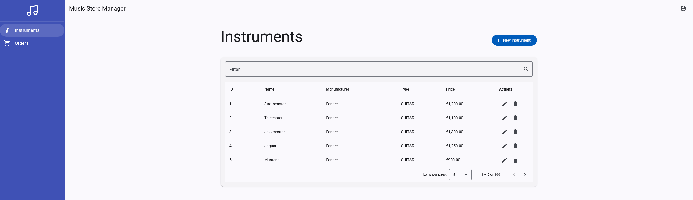

# Prerequisites

Before you begin this lab, you'll need to set up a few tools on your machine.

:::info
ℹ️ **What will you do and learn in this chapter?**

You will set up the environment in Github Codespaces and understand how to run it
:::

## Required Tools

### Skills

| Skill                                     | Level        | 
|-------------------------------------------|--------------|
| [Java](https://www.oracle.com/java/)      | intermediate |   
| [Maven](https://www.maven.apache.org/)    | novice       |
| [Quarkus](https://quarkus.io)             | novice       |
| [Angular](https://angular.io)             | novice       |
| [REST API](https://www.maven.apache.org/) | proficient   |

### Icons & Conventions

Before starting, we will use the following icons during the workshop. Let us check their meaning:

🛠️ An action to perform,  
📝 A file to modify,  
👀 Something to observe,  
✅ Validate something,  
ℹ️ Some information.

### Tools

#### If you want to execute this workshop on your desktop with [DevContainers](https://containers.dev/)

I stored a configuration to set the project up in DevContainer. You can check it out in the project [``.devcontainer/devcontainer.json``](https://github.com/alexandre-touret/feature-flag-workshop/tree/main/.devcontainer) file.

If you want to know more about DevContainers, you can check out this [documentation](https://containers.dev/).

You **MUST** have set up these tools first:

* [Docker](https://docs.docker.com/)
* An IDE: ([IntelliJ IDEA](https://www.jetbrains.com/idea) or [VSCode](https://code.visualstudio.com/)).

🛠️ You can validate your environment running these commands:

**Docker**

```jshelllanguage
$ docker version
    Client:
    Docker Engine -Community
    Version:
    27.4.1
    API version:1.47
    Go version:go1.22.10
    Git commit:b9d17ea
    Built:Tue Dec 17 15:45:46 2024
    OS/Arch:linux/amd64
    Context:default

```

#### If you want to execute this workshop on your desktop (without DevContainer) 

You **MUST** have sat up these tools first:

* [Java 25+](https://adoptium.net/temurin/releases/?version=25)
* [Maven 3.9](https://www.maven.apache.org/)
* [Docker](https://docs.docker.com/)
* [NodeJS/NPM](https://nodejs.org/en/)
* Any IDE ([IntelliJ IDEA](https://www.jetbrains.com/idea), [VSCode](https://code.visualstudio.com/), [Netbeans](https://netbeans.apache.org/),...) you want.

🛠️ You can validate your environment running these commands:

**Java**

```jshelllanguage
$ java -version
openjdk version "25.0.2" 2026-01-20 LTS
OpenJDK Runtime Environment Temurin-25.0.2+10 (build 25.0.2+10-LTS)
OpenJDK 64-Bit Server VM Temurin-25.0.2+10 (build 25.0.2+10-LTS, mixed mode, sharing)
```

**Maven**

```jshelllanguage
$ mvn --version
Apache Maven 3.9.14 (996c630dbc656c76214ce58821dcc58be960875b)
Maven home: /home/alexandre/.sdkman/candidates/maven/current
Java version: 25.0.2, vendor: Eclipse Adoptium, runtime: /home/alexandre/.sdkman/candidates/java/25.0.2-tem
Default locale: en, platform encoding: UTF-8
OS name: "linux", version: "6.6.87.2-microsoft-standard-wsl2", arch: "amd64", family: "unix"
```

**Docker**

```jshelllanguage
$ docker version
Client:
Version:           27.2.1-rd
API version:       1.45 (downgraded from 1.47)
Go version:        go1.22.7
Git commit:        cc0ee3e
Built:             Tue Sep 10 15:41:39 2024
OS/Arch:           linux/amd64
Context:           default

```

**NodeJS**
$ node --version
v24.11.1

**NPM**

```jshelllanguage
$ npm --version
11.12.1
```

**If you don't want to bother with a local setup**
It's strongly recommended to use [Github Codespaces](https://github.com/features/codespaces). You must create an account
first and [fork this repository](https://github.com/alexandre-touret/feature-flag-workshop/fork).

You can then open this project in either your local VS Code or directly in your browser.

**For the rest of this workshop, I will assume you will use GitHub CodeSpaces.**

## Environment Setup

### 🛠  Open Github CodeSpaces

* Log on [GitHub](https://github.com/) and
  [fork this repository](https://github.com/alexandre-touret/feature-flag-workshop/fork).
* Click on ``Code>Codespaces>Create a codespace`` on the ``main`` branch



When a message invites you making a URL public, select and validate it.

Wait until the codeSpace is ready.



During the first startup, the maven build is automatically started. Please wait until it is completely finished.

### 🛠 Start the backend

In a new terminal, start the Quarkus Dev environment:

```jshelllanguage
$ cd api
$ ./mvnw quarkus:dev
```

👀 Wait a while until you get the following output:

```jshelllanguage
__  ____  __  _____   ___  __ ____  ______
 --/ __ \/ / / / _ | / _ \/ //_/ / / / __/
 -/ /_/ / /_/ / __ |/ , _/ ,< / /_/ /\ \
--\___\_\____/_/ |_/_/|_/_/|_|\____/___/
2026-04-03 12:01:28,150 INFO  [io.quarkus] (Quarkus Main Thread) music-store-api 1.0.0-SNAPSHOT on JVM (powered by Quarkus 3.32.4) started in 12.962s. Listening on: http://localhost:8080
2026-04-03 12:01:28,158 INFO  [io.quarkus] (Quarkus Main Thread) Profile dev activated. Live Coding activated.
2026-04-03 12:01:28,160 INFO  [io.quarkus] (Quarkus Main Thread) Installed features: [agroal, cdi, compose, hibernate-orm, hibernate-orm-panache, hibernate-validator, jdbc-h2, narayana-jta, rest, rest-jackson, resteasy-problem, smallrye-context-propagation, smallrye-openapi, swagger-ui, vertx]
--
```

ℹ️ All the stack is provided through the [Quarkus Dev Services](https://quarkus.io/guides/dev-services).
You don't therefore have to bother yourself about setting it up.

✅ Now validate your setup browsing the Quarkus DEV-UI. 

Go to the VS Code Port panel.

Select the port tab:



Configure the port as public:



And now, go the URL which exposes the 8080 port:



and add the ``/q/dev-ui`` suffix.

For instance: ``https://laughing-giggle-x5x4rqxpwfv5pj-8080.app.github.dev/q/dev-ui``

ℹ️ You can also browse the dev-ui to the ``Extensions>SmallRye OpenAPI``.



:::warning

Unfortunately you will unable to test this API through the SwaggerUI. It seems to not support the usage of JSON headers.

:::
You can test it using httpie in a console :

```bash
http :8080/instruments User:'{"firstName":"john","lastName":"Doe","email":"john.doe@gmail.com","country":"FR"}' accept:"application/json"
```

```bash
http :8080/orders User:'{"firstName":"john","lastName":"Doe","email":"john.doe@gmail.com","country":"FR"}' accept:"application/json"
```

### 🛠 Start the frontend

#### Backend URL configuration

Pick up the previous URL (e.g., ``https://laughing-giggle-x5x4rqxpwfv5pj-8080.app.github.dev``) and configure the ``gui/src/proxy.conf.json`` file to reach the backend API:

:::warning
This URL : `https://laughing-giggle-x5x4rqxpwfv5pj-8080.app.github.dev` is just an example. Pick up the URL mentioned in the port screen of your Github CodeSpace.
:::

Update the ``target`` and ``secure`` attributes as following:

From:

```json
{
  "/api": {
    "target": "http://localhost:8080",
    "secure": false,
  [...]
  }
}
```

to


```json
{
  "/api": {
    "target": "https://laughing-giggle-x5x4rqxpwfv5pj-8080.app.github.dev",
    "secure": true,
  [...]
  }
}
```

In a new terminal, start the frontend dev environment:

```jshelllanguage
$ cd gui
$ npm start
```

👀 Wait a while until you get the following output:

```jshelllanguage
$ npm start

> music-store-gui@0.0.0 start
> ng serve

Component HMR has been enabled, see https://angular.dev/hmr for more info.
Initial chunk files | Names                     |  Raw size
polyfills.js        | polyfills                 |  89.77 kB |
styles.css          | styles                    |  56.10 kB |
main.js             | main                      |  32.28 kB |
chunk-C4KO2HLL.js   | -                         | 614 bytes |

                    | Initial total             | 178.76 kB

Lazy chunk files    | Names                     |  Raw size
chunk-OIKUF33N.js   | order-list-component      |  23.59 kB |
chunk-VWXPALOA.js   | order-edit-component      |  22.87 kB |
chunk-BMIW6227.js   | instrument-list-component |  22.79 kB |
chunk-FZXZTTLL.js   | instrument-edit-component |  16.86 kB |
chunk-C76H5XNX.js   | -                         |   4.80 kB |
chunk-GCFUDT6G.js   | -                         |   1.67 kB |
chunk-NFXMSM4A.js   | -                         |   1.39 kB |

Application bundle generation complete. [16.550 seconds]

Watch mode enabled. Watching for file changes...
NOTE: Raw file sizes do not reflect development server per-request transformations.
  ➜  Local:   http://localhost:4200/
```

✅ Now validate your setup browsing the **Music Store Manager Web UI**

Go to the ports tab (see above for more details) and select the URL exposed through the port ``4200`` that corresponds to the process ``ng serve``.

Open it and you should see this content:


