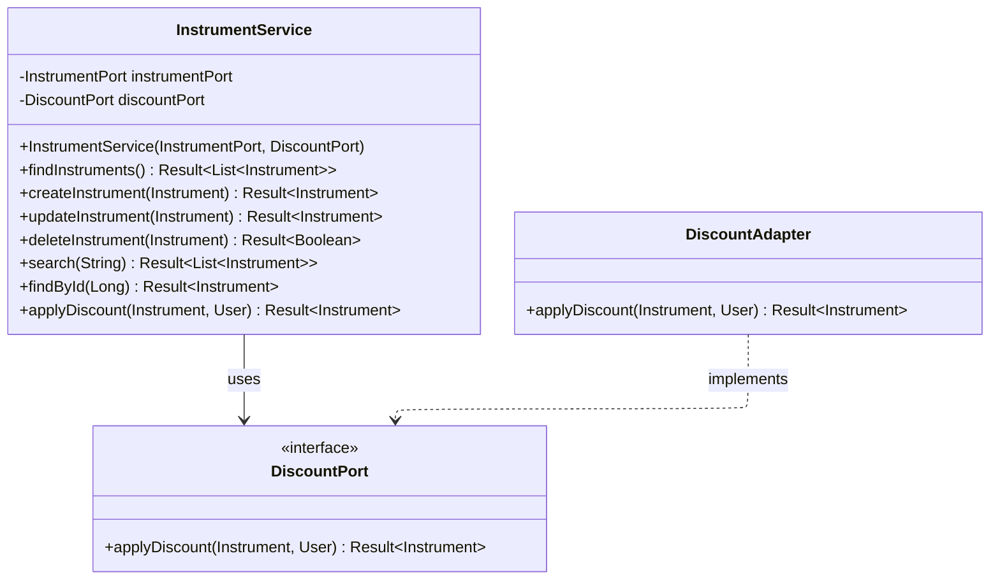
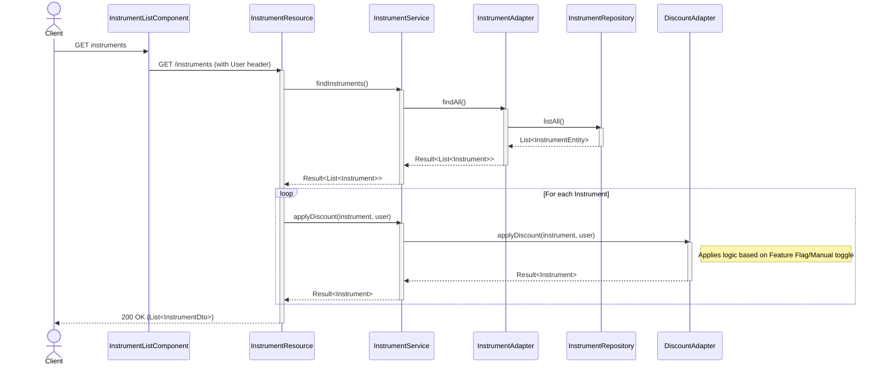
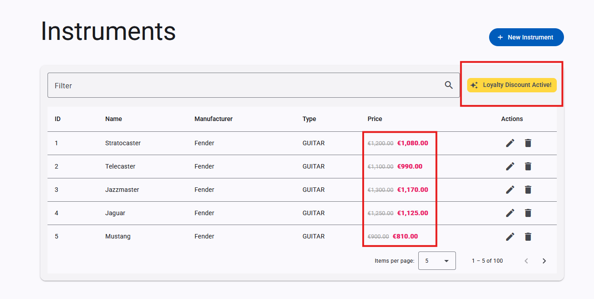

:::info
 ℹ️ What will you do and learn in this chapter?

- The feature to enable through feature-flag
- The implied pieces of code

:::

# The new Discount feature

## Purpose
The purpose of this feature is to apply a 10% discount on instruments. This allows you to test pricing changes, promotions, or A/B test a new pricing strategy without committing to permanent database changes.

It consists of two parts:
1. **Backend**: Applying the actual discount logic to the prices returned by the API.
2. **Frontend (GUI)**: Displaying a promotional banner and striking out the original price in favor of the discounted price.

## How is it implemented so far?

### In the API

The discount logic is currently centralized in the backend through the `DiscountPort` interface. The adapter `DiscountAdapter` implements this behavior.


Currently, it has a hardcoded variable (`manualDiscount`) set to `false`, effectively bypassing the discount logic and returning the instrument with its original price.

```java
// DiscountAdapter.java
boolean manualDiscount = false; // Toggle to true to test UI
if (manualDiscount) {
    double originalPrice = instrument.price();
    double discountedPrice = originalPrice * 0.9; // 10% discount
    return Result.success(instrument.withDiscount(discountedPrice, originalPrice));
}

return Result.success(instrument);
```

When activated, it sets the discounted price to `originalPrice * 0.9` and stores the original price in the `originalPrice` field of the returned instrument by utilizing the `instrument.withDiscount()` method.

The `InstrumentResource` handles retrieving the user contextual information via the `User` HTTP Header. It then delegates the logic to `InstrumentService.applyDiscount(Instrument, User)` before returning any results to the client.


#### The sequence diagram




### In the GUI

The frontend implementation is located in the `InstrumentListComponent` (`gui/src/app/pages/instruments/instrument-list/instrument-list.component.ts`).

It uses an Angular signal called `showDiscountBanner` to determine whether the promotional UI elements should be displayed.

```typescript
// instrument-list.component.ts
showDiscountBanner = signal(false);

private async initFeatureFlags() {
  // TODO: Implement OpenFeature initialization

  // For now, manually toggle or keep false
  this.showDiscountBanner.set(true); // Manually hardcoded to true for now
}
```

If `showDiscountBanner` is true, the UI displays a "Loyalty Discount Active!" banner. For instruments that have a discount (`row.hasDiscount`), it shows the original price crossed out alongside the new discounted price.

```html
@if (row.hasDiscount && showDiscountBanner()) {
  <span class="original-price">{{ row.originalPrice | currency:'EUR' }}</span>
  <span class="discounted-price">{{ row.price | currency:'EUR' }}</span>
} @else {
  {{ row.price | currency:'EUR' }}
}
```

## Test it "manually"

To test the discount behavior manually:

**1. Enable the Backend discount:**
1. 📝 Open `api/src/main/java/info/touret/musicstore/infrastructure/featureflag/adapter/DiscountAdapter.java`
2. 🛠️ Change `boolean manualDiscount = false;` to `boolean manualDiscount = true;`.
3. 👀 Observe the live-reload happening in your Quarkus console.

**2. Enable the Frontend UI banner:**
1. 📝 Open `gui/src/app/pages/instruments/instrument-list/instrument-list.component.ts`
2. 🛠️ Ensure `this.showDiscountBanner.set(true);` is present and set to `true` inside `initFeatureFlags()`.
3. 👀 Wait for the Angular dev server to recompile.

✅ Validate it by checking the Web UI:
- Open the Music Store Manager GUI in your browser.
- You should see the "Loyalty Discount Active!" banner at the top of the instruments list.
- The prices in the table should show the original price crossed out and the new discounted price in bold.



You can also make an HTTP request to the API:

```bash
http :8080/instruments User:'{"firstName":"john","lastName":"Doe","email":"john.doe@gmail.com","country":"FR"}' accept:"application/json"
```

You should now see the `price` being 10% lower, and the `originalPrice` field correctly populated in the responses.

For instance:
```json
[...]
 {
        "description": "MIDI Controller / Sequencer",
        "hasDiscount": true,
        "id": 100,
        "manufacturer": "Arturia",
        "name": "KeyStep Pro",
        "originalPrice": 450.0,
        "price": 405.0,
        "reference": "ART-KEY-01",
        "type": "PIANO"
    }
[...]
```

To deactivate it, simply revert `manualDiscount` to `false` in the backend and `this.showDiscountBanner.set(false);` in the frontend.
