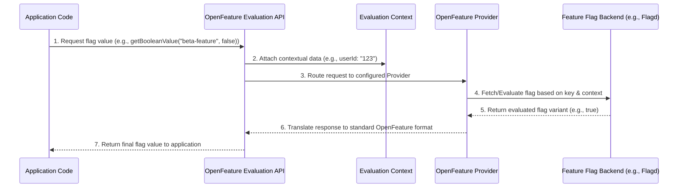
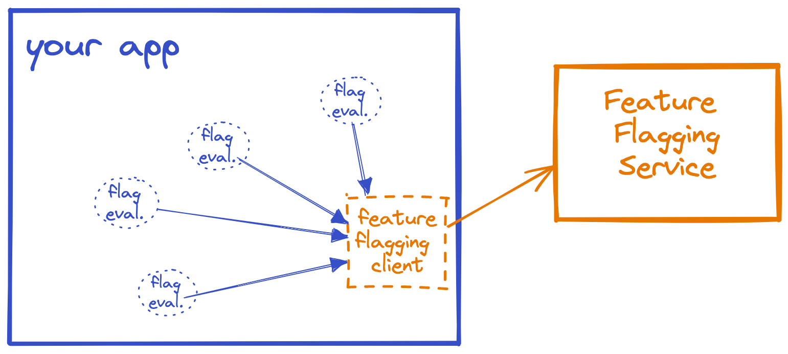
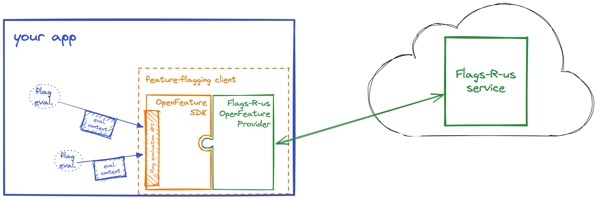

:::info
 ℹ️ What will you do and learn in this chapter?
- What is feature-Flag
- Why OpenFeature matters
- The OpenFeature's basics : Evaluation API, Provider, Context
- How to get more details from the evaluation API
- Using the FlagD provider
:::


# Getting started with OpenFeature & Feature Flagging

## What is Feature-Flagging?

Feature Flagging is a software development technique that allows teams to enable, disable, or modify features in an application at runtime without deploying new code.

By wrapping code in conditionals linked to a feature management system, you can decouple **deployment** (shipping the code to a server or device) from **release** (making the feature available to users). This brings several key benefits:

* **Trunk-Based Development**: Developers can safely merge incomplete features into the main branch by hiding them behind a flag.
* **Risk Mitigation**: If a new feature causes bugs or performance issues, it can be instantly disabled (a "kill switch") without requiring a stressful rollback or hotfix deployment.
* **Canary Releases & Progressive Delivery**: Roll out features gradually (e.g., 10% of users, then 50%, then 100%) to monitor impact.
* **A/B Testing**: Serve different variations of a feature to different segments of users to see which performs better.
* **Targeting**: Enable features only for specific users, such as internal testers, beta users, or premium subscribers.

### Feature Flagging vs. Feature Flipping: What's the difference?

While often used interchangeably, **Feature Flipping** (or Feature Toggles) is typically viewed as a more basic subset of Feature Flagging.

* **Feature Flipping** generally refers to simple binary switches (`ON` / `OFF`) often managed via static configuration files or simple database tables. They act as blunt instruments to enable or disable large blocks of functionality for everyone.
* **Feature Flagging**, on the other hand, implies a more robust, dynamic system capable of complex evaluation logic. It involves **contextual routing** (e.g., "Is this user a premium member in the EU region?") and **dynamic updates** in real-time without restarting the application. Feature flagging platforms provide dashboards, audit logs, and integrations to manage the lifecycle of these flags at scale.

## Why OpenFeature?

[OpenFeature](https://openfeature.dev/) is an open specification [sponsored by the CNCF](https://www.cncf.io/projects/openfeature/) that provides a vendor-agnostic, community-driven API for feature flagging that works with your favorite feature flag management tool or in-house solution.

In the past, integrating feature flags meant coupling your application to a specific vendor's SDK. If you wanted to switch vendors, or even use a mix of in-house and third-party tools, you'd have to rewrite all your feature flag evaluations.

**OpenFeature solves this by separating the evaluation API from the flag management system.**

It achieves this through a flexible architecture with three main components:
* **The Evaluation API**: The vendor-agnostic interface developers use in their application code to evaluate flags (e.g., `client.getBooleanValue("my-flag", false)`).
* **The Provider**: The translation layer between the OpenFeature API and the specific feature flagging backend (like LaunchDarkly, Split, Flagd, or even a simple in-memory map).
* **The Evaluation Context**: A mechanism to provide contextual information (like user IDs, tenant IDs, or request metadata) during flag evaluation to enable dynamic targeting rules.

Here is a diagram illustrating the flow from the Evaluation API down to the Provider:



By standardizing feature flagging, OpenFeature enables:
* **Vendor lock-in prevention**: Switch providers by changing a single line of configuration.
* **Consistency**: Use the same API across different languages and frameworks.
* **Extensibility**: Add common behaviors like logging, caching, or telemetry via [Hooks](https://openfeature.dev/docs/reference/concepts/hooks).

### What brings OpenFeature on top of Feature-Flag ?
Without OpenFeature:



With OpenFeature, we get a standardized API decoupling the feature flag repository to the clients:



_Source: https://openfeature.dev/docs/reference/intro_

🔗 **Learn more:** [OpenFeature Architecture & Concepts](https://openfeature.dev/docs/reference/intro)

## The Evaluation API

Let's not dig into the Evaluation API. For this first try, we will update the ``DiscountAdapter`` class to use now OpenFeature.

First, enable OpenFeature libraries in your classpath in the ``pom.xml`` file.

Uncomment this section:

```xml
   <dependency>
            <groupId>dev.openfeature</groupId>
            <artifactId>sdk</artifactId>
            <version>1.20.1</version>
        </dependency>
        <dependency>
            <groupId>dev.openfeature.contrib.providers</groupId>
            <artifactId>flagd</artifactId>
            <version>0.11.20</version>
        </dependency>
```

🛠️ Refresh your editor.

📝 Go to the ``DiscountAdapter`` class

🛠️ Add a new attribute to get the ``OpenFeatureAPI`` instance and update the constructor as following:

```java
    private final OpenFeatureAPI openFeatureAPI;

    public DiscountAdapter(OpenFeatureAPI openFeatureAPI) {
        this.openFeatureAPI = openFeatureAPI;
    }
```

In this way, the OpenFeatureAPI is automatically provided by CDI.

🛠 Update also the ``import`` declaration :

```java
import dev.openfeature.sdk.OpenFeatureAPI;
```

Then, comment the existing code and add the new one using OpenFeature:

```java
    @Override
    public Result<Instrument> applyDiscount(Instrument instrument, User user) {
        // TODO: Chapter 3 - Implement this with OpenFeature
        // For now, let's keep it simple (manually toggle for testing if needed)
//        boolean manualDiscount = false; // Toggle to true to test UI
//        if (manualDiscount) {
//            double originalPrice = instrument.price();
//            double discountedPrice = originalPrice * 0.9; // 10% discount
//            return Result.success(instrument.withDiscount(discountedPrice, originalPrice));
//        }
        boolean isDiscountEnabled = this.openFeatureAPI.getClient().getBooleanValue("discount-enabled", false);
        if (isDiscountEnabled) {
            double originalPrice = instrument.price();
            double discountedPrice = originalPrice * 0.9; // 10% discount
            return Result.success(instrument.withDiscount(discountedPrice, originalPrice));
        }
        return Result.success(instrument);
    }
```

👀 Look into the methods provided by the Client class.

At the end you would get this class:

```java
package info.touret.musicstore.infrastructure.featureflag.adapter;

import dev.openfeature.sdk.OpenFeatureAPI;
import info.touret.musicstore.domain.model.Instrument;
import info.touret.musicstore.domain.model.Result;
import info.touret.musicstore.domain.model.User;
import info.touret.musicstore.domain.port.DiscountPort;
import jakarta.enterprise.context.ApplicationScoped;

@ApplicationScoped
public class DiscountAdapter implements DiscountPort {

    private final OpenFeatureAPI openFeatureAPI;

    public DiscountAdapter(OpenFeatureAPI openFeatureAPI) {
        this.openFeatureAPI = openFeatureAPI;
    }

    @Override
    public Result<Instrument> applyDiscount(Instrument instrument, User user) {
        // TODO: Chapter 3 - Implement this with OpenFeature
        // For now, let's keep it simple (manually toggle for testing if needed)
//        boolean manualDiscount = false; // Toggle to true to test UI
//        if (manualDiscount) {
//            double originalPrice = instrument.price();
//            double discountedPrice = originalPrice * 0.9; // 10% discount
//            return Result.success(instrument.withDiscount(discountedPrice, originalPrice));
//        }
        boolean isDiscountEnabled = this.openFeatureAPI.getClient().getBooleanValue("discount-enabled", false);
        if (isDiscountEnabled) {
            double originalPrice = instrument.price();
            double discountedPrice = originalPrice * 0.9; // 10% discount
            return Result.success(instrument.withDiscount(discountedPrice, originalPrice));
        }
        return Result.success(instrument);
    }
}
```
At this point, your code won't work at all because we don't have declared the factory and the provider yet.

## In memory Provider

### First implementation

For our first try with OpenFeature, we will use the simplest provider: the [InMemoryProvider](https://hexdocs.pm/open_feature/OpenFeature.Provider.InMemory.html). It's only available for testing purpose.

🛠️ Create the class ``src/main/java/info/touret/musicstore/infrastructure/featureflag/openfeature/OpenFeatureFactory.java`` with the following content:

```java
package info.touret.musicstore.infrastructure.featureflag.openfeature;

import dev.openfeature.sdk.FeatureProvider;
import dev.openfeature.sdk.OpenFeatureAPI;
import dev.openfeature.sdk.providers.memory.Flag;
import dev.openfeature.sdk.providers.memory.InMemoryProvider;
import io.quarkus.arc.Arc;
import jakarta.annotation.PreDestroy;
import jakarta.enterprise.context.ApplicationScoped;
import jakarta.ws.rs.Produces;
import org.slf4j.Logger;
import org.slf4j.LoggerFactory;

import java.util.Map;

/**
 * OpenFeature Factory CLass
 */
@ApplicationScoped
public class OpenFeatureFactory {

    private static final Logger LOGGER = LoggerFactory.getLogger(OpenFeatureFactory.class);

    /**
     * Creates the provider
     * @return The {@link FeatureProvider} instance
     * @see dev.openfeature.sdk.providers.memory.InMemoryProvider
     */
    private FeatureProvider createProvider() {
        Map<String, Flag<?>> flags = Map.of(
                // Creates a flag to enable discounts
                "discount-enabled", Flag.builder()
                        .variant("on", true)
                        .variant("off", false)
                        .defaultVariant("on")
                        .build(),
                // Creates a flag to show the welcome message
                "welcome-message", Flag.builder()
                        .variant("greeting", "Bienvenue sur notre boutique !")
                        .variant("empty", "")
                        .defaultVariant("greeting")
                        .build()
        );
        return new InMemoryProvider(flags);
    }

    /**
     * Creates the {@link OpenFeatureAPI} instance
     * @return The {@link OpenFeatureAPI} instance
     */
    @ApplicationScoped
    @Produces
    public OpenFeatureAPI getOpenFeatureAPIInstance() {
        var openFeatureAPI = OpenFeatureAPI.getInstance();
        openFeatureAPI.setProvider(createProvider());
        return openFeatureAPI;
    }

    /**
     * Destroys the OpenFeature instance and flushes pending events
     */
    @PreDestroy
    private void shutdownProvider() {
        try {
            var openFeatureAPI = Arc.container().select(OpenFeatureAPI.class).get();
            if (openFeatureAPI != null) {
                openFeatureAPI.shutdown();
            }
        } catch (Exception e) {
            LOGGER.warn("Failing to shutdown the provider");
        }
    }
}
```

🛠️ Restart your Quarkus Dev environment by typing ``Ctrl+C`` in your console and restart the command:

```bash
./mvnw quarkus:dev
```

👀 Validate your unit/integration tests typing `'r'` to resume testing.

You should see this output in your console:

```bash
--
All 56 tests are passing (0 skipped), 56 tests were run in 11808ms. Tests completed at 07:48:01.
```

🛠️ You can also run this API call with the ``httpie`` tool in another terminal:

```bash
http :8080/instruments User:'{"firstName":"john","lastName":"Doe","email":"john.doe@gmail.com","country":"FR"}' accept:"application/json"
```

You should see the same content than before:

```json
 {
        "description": "MIDI Controller / Sequencer",
        "hasDiscount": true,
        "id": 100,
        "manufacturer": "Arturia",
        "name": "KeyStep Pro",
        "originalPrice": 450.0,
        "price": 405.0,
        "reference": "ART-KEY-01",
        "type": "PIANO"
    }
```

### Getting more details

[OpenFeature brings also an API to get more details about the evaluation](https://openfeature.dev/docs/reference/concepts/evaluation-api/#detailed-evaluation). We will see how it matters to make it full observable in the Observability Chapter.

Let's see how to put it in place:

🛠️ Update the code located in the method ``applyDiscount`` of the ``DiscountAdapter`` class:

From:

```java
boolean isDiscountEnabled = this.openFeatureAPI.getClient().getBooleanValue("discount-enabled", false);
```

```java
var evaluationDetails = this.openFeatureAPI.getClient().getBooleanDetails("discount-enabled", false);
LOGGER.info(evaluationDetails.toString());
boolean isDiscountEnabled = evaluationDetails.getValue();
```

The logger will help us see what is provided through the details:

```bash
2026-04-13 19:32:23,833 INFO  [info.touret.musicstore.infrastructure.featureflag.adapter.DiscountAdapter] (main) FlagEvaluationDetails(flagKey=discount-enabled, value=true, variant=on, reason=STATIC, errorCode=null, errorMessage=null, flagMetadata=dev.openfeature.sdk.ImmutableMetadata@3b)
```

Next, change the flag-key to ``wrong-discount-enabled`` :

```java
var evaluationDetails = this.openFeatureAPI.getClient().getBooleanDetails("wrong-discount-enabled", false);
LOGGER.info(evaluationDetails.toString());
boolean isDiscountEnabled = evaluationDetails.getValue();
```

You should see in the console such an output:

```bash
 mapstruct.suppressGeneratorVersionInfoComment, mapstruct.defaultComponentModel, mapstruct.suppressGeneratorTimestamp]', line -1 in [unknown source]
2026-04-14 07:50:12,773 INFO  [io.quarkus.hibernate.orm.deployment.dev.HibernateOrmDevServicesProcessor] (build-15) Setting quarkus.hibernate-orm.schema-management.strategy=drop-and-create to initialize Dev Services managed database
2026-04-14 07:50:14,035 INFO  [io.quarkus.arc.processor.BeanProcessor] (build-5) Found unrecommended usage of private members (use package-private instead) in application beans:
        - @PreDestroy callback info.touret.musicstore.infrastructure.featureflag.openfeature.OpenFeatureFactory#shutdownProvider()
2026-04-14 07:50:15,418 ERROR [io.quarkus.test] (Test runner thread) ==================== TEST REPORT #2 ====================
2026-04-14 07:50:15,418 ERROR [io.quarkus.test] (Test runner thread) Test DiscountAdapterTest#should_return_the_instrument_with_a_discount_successfully() failed
: org.opentest4j.AssertionFailedError: expected: <4050.0> but was: <4500.0>
        at org.junit.jupiter.api.AssertionFailureBuilder.build(AssertionFailureBuilder.java:158)
        at org.junit.jupiter.api.AssertionFailureBuilder.buildAndThrow(AssertionFailureBuilder.java:139)
        at org.junit.jupiter.api.AssertEquals.failNotEqual(AssertEquals.java:201)
        at org.junit.jupiter.api.AssertEquals.assertEquals(AssertEquals.java:184)
        at org.junit.jupiter.api.AssertEquals.assertEquals(AssertEquals.java:179)
        at org.junit.jupiter.api.Assertions.assertEquals(Assertions.java:933)
        at info.touret.musicstore.infrastructure.featureflag.adapter.DiscountAdapterTest.should_return_the_instrument_with_a_discount_successfully(DiscountAdapterTest.java:28)


2026-04-14 07:50:15,420 ERROR [io.quarkus.test] (Test runner thread) >>>>>>>>>>>>>>>>>>>> Summary: <<<<<<<<<<<<<<<<<<<<
info.touret.musicstore.infrastructure.featureflag.adapter.DiscountAdapterTest#should_return_the_instrument_with_a_discount_successfully(DiscountAdapterTest.java:28) DiscountAdapterTest#should_return_the_instrument_with_a_discount_successfully() expected: <4050.0> but was: <4500.0>
2026-04-14 07:50:15,421 ERROR [io.quarkus.test] (Test runner thread) >>>>>>>>>>>>>>>>>>>> 1 TEST FAILED <<<<<<<<<<<<<<<<<<<<
```

It means the flag key wasn't found and the default value was taken in account.

If you recall the API using this command:

```bash
http :8080/instruments User:'{"firstName":"john","lastName":"Doe","email":"john.doe@gmail.com","country":"FR"}' accept:"application/json"
```

👀 You would see the details of the feature-flag value resolution:

```bash
2026-04-14 07:53:13,694 INFO  [info.touret.musicstore.infrastructure.featureflag.adapter.DiscountAdapter] (quarkus-virtual-thread-0) FlagEvaluationDetails(flagKey=wrong-discount-enabled, value=false, variant=null, reason=ERROR, errorCode=FLAG_NOT_FOUND, errorMessage=flag wrong-discount-enabled not found, flagMetadata=dev.openfeature.sdk.ImmutableMetadata@3b)
2026-04-14 07:53:13,694 DEBUG [info.touret.musicstore.domain.service.InstrumentService] (quarkus-virtual-thread-0) Applying discount to instrument [Instrument{id=100, name='KeyStep Pro', reference='ART-KEY-01', manufacturer='Arturia', price=450.0, description='MIDI Controller / Sequencer', type=PIANO}] for user [User{firstname='null', lastname='null', email='john.doe@gmail.com', country='FR'}]
```

Finally, restore the good flag key to ``discount-enabled``:

```java
var evaluationDetails = this.openFeatureAPI.getClient().getBooleanDetails("discount-enabled", false);
LOGGER.info(evaluationDetails.toString());
boolean isDiscountEnabled = evaluationDetails.getValue();
```

## Flagd

OpenFeature provides many [SDK to interact with different feature flag providers](https://openfeature.dev/ecosystem?instant_search%5BrefinementList%5D%5Btype%5D%5B0%5D=Provider).

We will now improve our application moving our in memory provider to [Flagd](https://github.com/open-feature/java-sdk-contrib/tree/main/providers/flagd).

It provides different ways to retrieve and resolve flags:
- Through a [RPC server](https://github.com/open-feature/java-sdk-contrib/tree/main/providers/flagd#configuration-and-usage)
- Through an internally managed process
- From a file

During this workshop we will use the offline mode with a configuration file.

🛠️ Go to the `OpenFeatureFactory` class and update the ``createProvider()`` method as below:

From:

```java
private FeatureProvider createProvider() {
    Map<String, Flag<?>> flags = Map.of(
            // Creates a flag to enable discounts
            "discount-enabled", Flag.builder()
                    .variant("on", true)
                    .variant("off", false)
                    .defaultVariant("on")
                    .build(),
            // Creates a flag to show the welcome message
            "welcome-message", Flag.builder()
                    .variant("greeting", "Bienvenue sur notre boutique !")
                    .variant("empty", "")
                    .defaultVariant("greeting")
                    .build()
    );
    return new InMemoryProvider(flags);
}
```

To

```java
private FeatureProvider createProvider() {
    return new FlagdProvider(
            FlagdOptions.builder()
                    .resolverType(Config.Resolver.FILE)
                    .offlineFlagSourcePath(Thread.currentThread().getContextClassLoader().getResource("/flags.flagd.json").getPath())
                    .build());
}
```
This setup relies on a file located to ``src/main/resources/flags.flagd.json``.

We can now push the former rules to this file as following:

```json
{
  "flags": {
    "welcome-message": {
      "variants": {
        "on": true,
        "off": false
      },
      "state": "ENABLED",
      "defaultVariant": "on"
    },
    "discount-enabled": {
      "variants": {
        "on": true,
        "off": false
      },
      "state": "ENABLED",
      "defaultVariant": "on"
    }
  }
}

```

Save it and restart the integration tests.

You can either type `'r'` on the Quarkus Dev environment and get the following output:

```bash
--
All 56 tests are passing (0 skipped), 56 tests were run in 1931ms. Tests completed at 16:51:58.
```
If it doesn't work, feel free to restart it.

You can also run the following command:

```bash
./mvnw clean verify
```

## Evaluation Context

Beyond just a static true/false flag, OpenFeature provides the ability to evaluate the flag with different parameters.
These ones may be global at the application or dependent of the current transactions.

For instance, we may set a global static parameter which enable a feature for all the users and a client parameter to enable a feature taking into account a session parameter such as the country of the current user.

We will implement the latter now.


