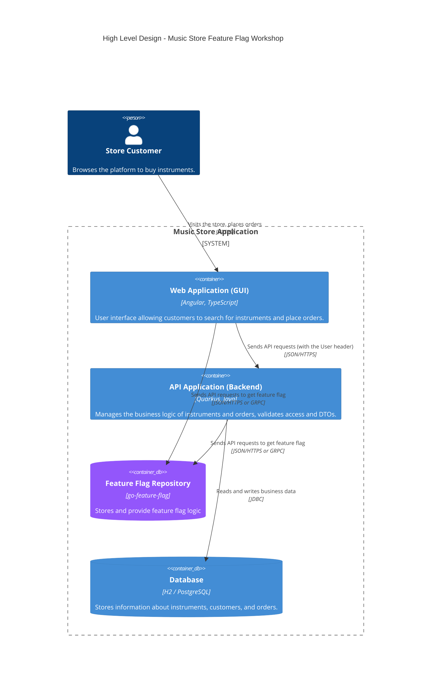

:::info
 ℹ️ What will you do and learn in this chapter?
- Get an overview of a Feature Flag system with [GO Feature Flag](https://gofeatureflag.org/)
- Know how to create a feature flag on GO Feature Flag
- Integrate it into a Java project
:::

# A sneak peek of Feature Flag management with GO Feature Flag

## The OpenFeature Galaxy

The true power of **OpenFeature** lies in its vibrant ecosystem. Because OpenFeature acts as a standardized abstraction layer (a vendor-agnostic Evaluation API), you are never locked into a single feature flag provider.

This ecosystem is composed of **Providers**: the software components that translate OpenFeature API calls into the specific logic required by a backend feature flag management system.

There are providers for almost every major feature flagging solution on the market, including:
- **Commercial SaaS Platforms**: LaunchDarkly, Split, Statsig, ConfigCat, CloudBees, Harness, etc.
- **Open Source Solutions**: Flagd, Unleash, Flipt, PostHog, **GO Feature Flag**.
- **In-house / Cloud Native**: Kubernetes ConfigMaps, AWS AppConfig, or simple In-Memory Providers (like we used in the previous chapter).

This means you can start small with a simple file-based system (like Flagd) during development or early startup phases, and seamlessly migrate to a robust enterprise platform like LaunchDarkly or GO Feature Flag as your team scales—all without changing a single line of your application code! You simply swap out the OpenFeature Provider during application startup.

## GO Feature Flag introduction

[GO Feature Flag](https://gofeatureflag.org/) is an open-source, complete and lightweight feature flag solution. It allows you to manage your feature flags natively without needing complex infrastructure.

Unlike some platforms that require a heavy server setup and a database, GO Feature Flag can run as a relay proxy, but its core principle is to use a simple configuration file (YAML, JSON, TOML) stored in various locations (GitHub, S3, HTTP, Kubernetes, etc.) to evaluate flags.

In this chapter, we will replace our static `flagd.json` file with a live GO Feature Flag relay proxy. You will learn how to configure features dynamically and observe the changes in your Java application in real-time, leveraging the OpenFeature GO Feature Flag Provider!

### Target Architecture

As a reminder, below the target architecture of our solution.



## Getting started

Open a new shell and run this command:

```bash
$ cd infrastructure && docker compose up -d
```

Wait until the entire infrastructure has been executed.

Run then this command to check if GO Feature Flag runs well:

```bash
$ docker compose ps
```
You should get this output:

```bash
NAME                               IMAGE                                  COMMAND              SERVICE           CREATED          STATUS          PORTS
infrastructure-go-feature-flag-1   gofeatureflag/go-feature-flag:latest   "/go-feature-flag"   go-feature-flag   28 minutes ago   Up 17 seconds   0.0.0.0:1031->1031/tcp, [::]:1031->1031/tcp
```

Check out the file ``infrastructure/go-feature-flag/flags.yaml``

You can see it contains the same configuration we implemented with Flagd.

Let's test it out:

Check first the flag status for a French customer:

```bash
http POST http://localhost:1031/v1/allflags \
  user:='{"key": "client-fr-1", "custom": {"clientCountry": "FRANCE"}}'
```

You should get this output:

```bash
HTTP/1.1 200 OK
Content-Length: 430
Content-Type: application/json
Date: Tue, 21 Apr 2026 13:03:46 GMT
Vary: Origin
X-Gofeatureflag-Version: 1.52.1

{
    "flags": {
        "discount-amount": {
            "errorCode": "",
            "reason": "DEFAULT",
            "timestamp": 1776776626,
            "trackEvents": true,
            "value": 0.1,
            "variationType": "10-percent"
        },
        "discount-enabled": {
            "errorCode": "",
            "reason": "TARGETING_MATCH",
            "timestamp": 1776776626,
            "trackEvents": true,
            "value": true,
            "variationType": "on"
        },
        "welcome-message": {
            "errorCode": "",
            "reason": "STATIC",
            "timestamp": 1776776626,
            "trackEvents": true,
            "value": true,
            "variationType": "on"
        }
    },
    "valid": true
}
```

Now, let's evaluate the discount for a German customer:

```bash
http POST http://localhost:1031/v1/feature/discount-amount/eval \
  user:='{"key": "client-de-1", "custom": {"clientCountry": "GERMANY"}}'

```

You should get this response:

```bash
HTTP/1.1 200 OK
Content-Length: 149
Content-Type: application/json
Date: Tue, 21 Apr 2026 13:47:34 GMT
Vary: Origin
X-Gofeatureflag-Version: 1.52.1

{
    "cacheable": true,
    "errorCode": "",
    "failed": false,
    "reason": "TARGETING_MATCH",
    "trackEvents": true,
    "value": 0.5,
    "variationType": "50-percent",
    "version": ""
}
```

## Integrate Go Feature Flag in our API
