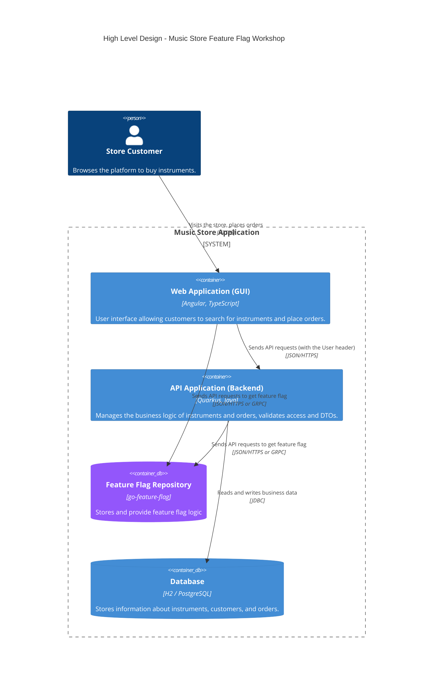

:::info
 ℹ️ What will you do and learn in this chapter?
- Get an overview of a Feature Flag system with [GO Feature Flag](https://gofeatureflag.org/)
- Know how to create a feature flag on GO Feature Flag
- Integrate it into a Java project
:::

# A sneak peek of Feature Flag management with GO Feature Flag

## The OpenFeature Galaxy

The true power of **OpenFeature** lies in its ecosystem. Because OpenFeature acts as a standardized abstraction layer (a vendor-agnostic Evaluation API), you are never locked into a single feature flag provider.

This ecosystem is composed of **Providers**: the software components that translate OpenFeature API calls into the specific logic required by a backend feature flag management system.

There are providers for almost every major feature flagging solution on the market, including:
- **Commercial SaaS Platforms**: LaunchDarkly, Split, Statsig, ConfigCat, CloudBees, Harness, etc.
- **Open Source Solutions**: Flagd, Unleash, Flipt, PostHog, **GO Feature Flag**.
- **In-house / Cloud Native**: Kubernetes ConfigMaps, AWS AppConfig, or simple In-Memory Providers (like we used in the previous chapter).

This means you can start small with a simple file-based system (like Flagd) during development or early startup phases, and seamlessly migrate to a robust enterprise platform like LaunchDarkly or GO Feature Flag as your team scales—all without (_mostly_) changing a single line of your application code! You simply swap out the OpenFeature Provider during application startup.

## GO Feature Flag introduction

[GO Feature Flag](https://gofeatureflag.org/) is an open-source, complete and lightweight feature flag solution. It allows you to manage your feature flags natively without needing complex infrastructure.

Unlike some traditional enterprise feature-flagging platforms that require heavy database setups and complex infrastructure, **GO Feature Flag** is designed to be fully cloud-native, lightweight, and stateless.

Its architecture revolves around three core concepts:

1. **The Flag Source (No Database Required):**
   Instead of a database, your feature flags and targeting rules are defined in a simple configuration file (YAML, JSON, or TOML). This file acts as your single source of truth and can be hosted anywhere: a GitHub repository, an AWS S3 bucket, a Kubernetes ConfigMap, or even a simple HTTP server.
2. **The Relay Proxy:**
   This is a lightweight, standalone service (written in Go) that acts as the brain. It periodically fetches the flag configuration file from your chosen Flag Source. It then exposes a standard API (REST or gRPC) that your applications can query to evaluate flags.
3. **The SDKs & OpenFeature Providers:**
   Your application (whether it's a Java backend or an Angular frontend) uses an OpenFeature provider to communicate with the Relay Proxy. When a user requests a page, the app asks the Relay Proxy: *"Should this feature be enabled for this specific user context?"* The proxy evaluates the rules in memory and returns the answer instantly.

**Why this matters for your deployments:**
Because it relies on files rather than databases, you can manage your feature flags using standard GitOps practices (PRs, code reviews, rollbacks). Furthermore, because the Relay Proxy evaluates rules in-memory, it provides incredibly fast, low-latency flag resolution without the overhead of external network hops to a SaaS provider.


<div style={{textAlign: 'center'}}>
_Source: https://gofeatureflag.org/docs/concepts/architecture_
</div>

### Target Architecture

As a reminder, below is the target architecture of our solution.



## Getting started

🛠️ Go to the shell running Quarkus. Stop it by typing `Ctrl+C`.

📝 Open the file `src/main/resources/application.properties`.
🛠️ Add the following content:

```properties
go-feature-flag.url=http://localhost:1031
go-feature-flag.polling-interval=10000
quarkus.compose.devservices.files=src/main/docker/compose-devservices.yml
```

📝 Go then to the file `src/test/resources/application.properties`.
🛠️ Add the following content:

```properties
go-feature-flag.url=http://localhost:1032
%test.quarkus.compose.devservices.files=src/main/docker/compose-test-devservices.yml
```
👀 Check out the file `src/main/docker/go-feature-flag/flags.yaml`.

👀 You can see it contains the same configuration we implemented with Flagd but adapted for GO Feature Flag.

For instance:

```yaml
discount-enabled:
  variations:
    on: true
    off: false
  targeting:
    - query: clientCountry in ["FRANCE", "GERMANY", "UK"]
      variation: on
  defaultRule:
    variation: off
```


🛠️ Run Quarkus again in the `api` folder:

```bash
$ ./mvnw clean quarkus:dev
```

Wait until you see the Quarkus logo:

```bash
 --/ __ \/ / / / _ | / _ \/ //_/ / / / __/
 -/ /_/ / /_/ / __ |/ , _/ ,< / /_/ /\ \
--\___\_\____/_/ |_/_/|_/_/|_|\____/___/
```

🛠️ Type then `c`.
👀 You should get this output:

```bash
== Dev Services

Compose Dev Services
  Injected config:  - com.docker.compose.project=quarkus-devservices-music-store-api

jdbc-h2
  Injected config:  - quarkus.datasource.jdbc.url=jdbc:h2:tcp://localhost:39279/mem:quarkus;DB_CLOSE_DELAY=-1

Additional Dev Services config
  Injected config:  - quarkus.hibernate-orm.schema-management.strategy=drop-and-create
```

🛠️ Run then the command `docker ps` in another console to check if our container is fully ready:

```bash
docker ps
CONTAINER ID   IMAGE                                  COMMAND              CREATED         STATUS         PORTS                                           NAMES
3ea0edd63224   gofeatureflag/go-feature-flag:trixie   "/go-feature-flag"   2 minutes ago   Up 2 minutes   0.0.0.0:1031->1031/tcp, [::]:1031->1031/tcp     quarkus-devservices-music-store-api-go-feature-flag-1
3d954cad4bbe   testcontainers/ryuk:0.13.0             "/bin/ryuk"          2 minutes ago   Up 2 minutes   0.0.0.0:32768->8080/tcp, [::]:32768->8080/tcp   testcontainers-ryuk-9789e62b-cf69-4fe7-9d09-6c293f8c1912
```

✅ Now Go Feature Flag Dev Service is ready!

🛠️ Open a new shell (or an unused one) and test it out.

🛠️ Check first the flag status for a French customer:

```bash
$ http POST http://localhost:1031/v1/allflags \
  user:='{"key": "client-fr-1", "custom": {"clientCountry": "FRANCE"}}'
```

👀 You should get this output:

```bash
HTTP/1.1 200 OK
Content-Length: 430
Content-Type: application/json
Date: Tue, 21 Apr 2026 13:03:46 GMT
Vary: Origin
X-Gofeatureflag-Version: 1.52.1

{
    "flags": {
        "discount-amount": {
            "errorCode": "",
            "reason": "DEFAULT",
            "timestamp": 1776776626,
            "trackEvents": true,
            "value": 0.1,
            "variationType": "10-percent"
        },
        "discount-enabled": {
            "errorCode": "",
            "reason": "TARGETING_MATCH",
            "timestamp": 1776776626,
            "trackEvents": true,
            "value": true,
            "variationType": "on"
        },
        "welcome-message": {
            "errorCode": "",
            "reason": "STATIC",
            "timestamp": 1776776626,
            "trackEvents": true,
            "value": true,
            "variationType": "on"
        }
    },
    "valid": true
}
```

🛠️ Now, let's evaluate the discount for a German customer:

```bash
$ http POST http://localhost:1031/v1/feature/discount-amount/eval \
  user:='{"key": "client-de-1", "custom": {"clientCountry": "GERMANY"}}'

```

👀 You should get this response:

```bash
HTTP/1.1 200 OK
Content-Length: 149
Content-Type: application/json
Date: Tue, 21 Apr 2026 13:47:34 GMT
Vary: Origin
X-Gofeatureflag-Version: 1.52.1

{
    "cacheable": true,
    "errorCode": "",
    "failed": false,
    "reason": "TARGETING_MATCH",
    "trackEvents": true,
    "value": 0.5,
    "variationType": "50-percent",
    "version": ""
}
```

## Integrate Go Feature Flag in our API

🛠️ Stop Quarkus by typing `Ctrl+C`.

📝 Go to the `pom.xml` file.
🛠️ Add the following dependency:

```xml
<dependency>
    <groupId>dev.openfeature.contrib.providers</groupId>
    <artifactId>go-feature-flag</artifactId>
    <version>1.1.1</version>
</dependency>
```

🛠️ You can also comment out the Flagd provider dependency:

```xml
<!--    <dependency>
            <groupId>dev.openfeature.contrib.providers</groupId>
            <artifactId>flagd</artifactId>
            <version>0.11.20</version>
        </dependency>-->
```

🛠️ Run the following command:

```bash
$ ./mvnw compile
```

🛠️ Reload your IDE.

📝 Go to the `OpenFeatureFactory` class.
🛠️ Update the method `createProvider()` with the following content:

```java
    @ConfigProperty(name = "go-feature-flag.url")
    String goFeatureFlagUrl;

    @ConfigProperty(name = "go-feature-flag.polling-interval")
    long goFeatureFLagPollingInterval;

    private FeatureProvider createProvider() {
/* Solution using Flagd
return new FlagdProvider(
                FlagdOptions.builder()
                        .resolverType(Config.Resolver.FILE)
                        .offlineFlagSourcePath(Thread.currentThread().getContextClassLoader().getResource("/flags.flagd.json").getPath())
                        .build());*/

        try {
            return new GoFeatureFlagProvider(GoFeatureFlagProviderOptions.builder()
                    .endpoint(goFeatureFlagUrl)
                    .flagChangePollingIntervalMs(goFeatureFLagPollingInterval)
                    .build());
        } catch (InvalidOptions e) {
            LOGGER.error("Unable to create the OpenFeature provider instance with this URL : [{}]", goFeatureFlagUrl);
            throw new RuntimeException(e);
        }
    }
```

🛠️ Update then the import declarations with:

```java
import dev.openfeature.contrib.providers.gofeatureflag.GoFeatureFlagProvider;
import dev.openfeature.contrib.providers.gofeatureflag.GoFeatureFlagProviderOptions;
import dev.openfeature.contrib.providers.gofeatureflag.exception.InvalidOptions;
import org.eclipse.microprofile.config.inject.ConfigProperty;
```
:::info
ℹ️ [GoFeatureFlag requires the presence of a `targetingKey`](https://gofeatureflag.org/docs/concepts/evaluation-context#targeting-key), which is a unique identifier that represents the context of the evaluation (email, session id, a fingerprint or anything that is consistent).
Through this key, we will ensure keeping the same behavior across different visits or sessions.
:::

📝 Go to the `DiscountAdapter` class.
🛠️ Update the creation of the evaluation context:

From:

```java
openFeatureAPIClient.setEvaluationContext(new MutableContext().add("clientCountry", user.country()));
```

To:
```java
openFeatureAPIClient.setEvaluationContext(new MutableContext().add("clientCountry", user.country()).add("targetingKey", user.email()));
```

🛠️ Restart Quarkus:

```bash
$ ./mvnw clean quarkus:dev
```

🛠️ Run the tests by typing `r`.

✅ You should get all the tests successful:

```bash
--
All 58 tests are passing (0 skipped), 58 tests were run in 23469ms. Tests completed at 11:28:57.
Press [e] to edit command line args (currently ''), [r] to re-run, [o] Toggle test output, [:] for the terminal, [h] for more options>
```

:::tip
In this workshop, we created the provider using a private method `createProvider()`. For more flexibility, we can inject it into the [CDI context](https://quarkus.io/guides/cdi-reference) and inject an `InMemoryProvider` as we did previously in our tests instead of using TestContainer.
:::
