:::info
 ℹ️ What will you do and learn in this chapter?
- Get an overview of a Feature Flag system with [UnLeash](https://www.getunleash.io/open-source)
- Know of to create a feature flag on UnLeash
- Integrate it into a Java project
:::

# A sneak peek of Feature Flag management with UnLeash

## The OpenFeature Galaxy

The true power of **OpenFeature** lies in its vibrant ecosystem. Because OpenFeature acts as a standardized abstraction layer (a vendor-agnostic Evaluation API), you are never locked into a single feature flag provider.

This ecosystem is composed of **Providers**: the software components that translate OpenFeature API calls into the specific logic required by a backend feature flag management system.

There are providers for almost every major feature flagging solution on the market, including:
- **Commercial SaaS Platforms**: LaunchDarkly, Split, Statsig, ConfigCat, CloudBees, Harness, etc.
- **Open Source Solutions**: Flagd, Unleash, Flipt, PostHog, Go Feature Flag.
- **In-house / Cloud Native**: Kubernetes ConfigMaps, AWS AppConfig, or simple In-Memory Providers (like we used in the previous chapter).

This means you can start small with a simple file-based system (like Flagd) during development or early startup phases, and seamlessly migrate to a robust enterprise platform like LaunchDarkly or Unleash as your team scales—all without changing a single line of your application code! You simply swap out the OpenFeature Provider during application startup.

## UnLeash introduction

[Unleash](https://www.getunleash.io/) is an open-source, enterprise-ready feature management platform. It provides a comprehensive solution for managing feature flags at scale with a focus on privacy, security, and developer experience.

Unleash consists of two main components:
1. **The Unleash Server (Admin UI & API)**: A central hub where product managers and developers can create flags, define targeting rules (called "Activation Strategies" in Unleash), view metrics, and manage environments (e.g., Development vs. Production).
2. **The Unleash SDK (or the OpenFeature Provider)**: The client that runs within your application. Unlike some platforms that require a network call for every flag evaluation, Unleash SDKs fetch the flag configurations in the background and evaluate them *locally* in memory. This ensures sub-millisecond evaluation times and means your app keeps working even if the Unleash server goes down.

In this chapter, we will replace our static `flagd.json` file with a live Unleash server. You will learn how to use the Unleash UI to toggle features dynamically and observe the changes in your Java application in real-time, leveraging the OpenFeature Unleash Provider!

### Target Architecture

As a reminder, below the target architecture of our solution.

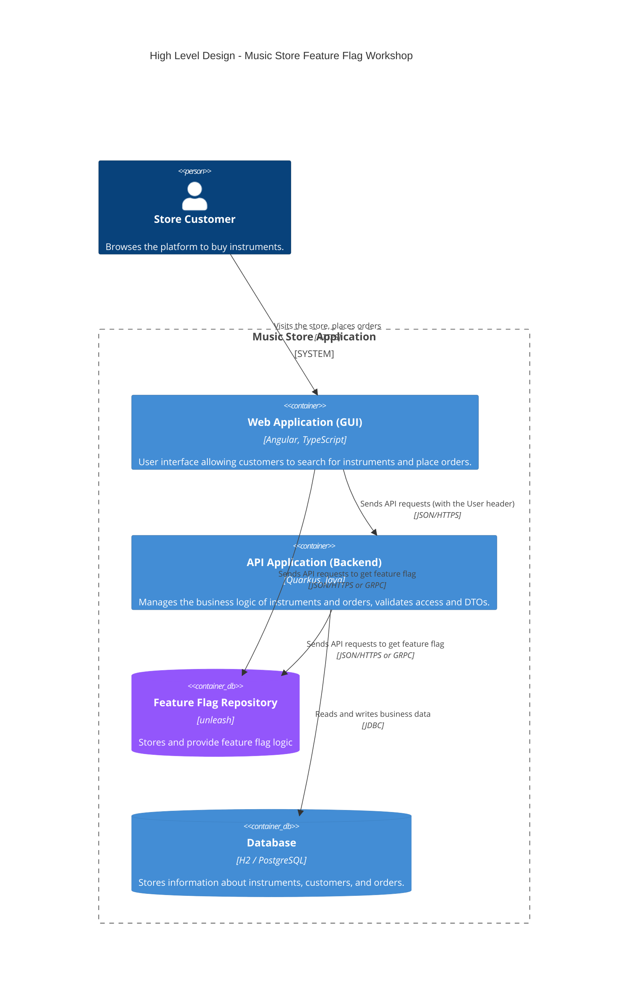

## Getting started

Open a new shell and run this command:

```bash
$ cd infrastructure && docker compose up -d
```

What until the entire infrastructure has been executed.
You should see this log:

```bash
❯ cd infrastructure && docker compose up -d
WARN[0000] No services to build
[+] up 3/3
 ✔ Network infrastructure_default Created                                                                                                                                                     0.0s
 ✔ Container infrastructure-db-1  Healthy                                                                                                                                                     5.9s
 ✔ Container infrastructure-web-1 Created
```

As you did previously for the Quarkus's Dev UI, you would be able to open the URL corresponding to the ``4242`` port (e.g., ``https://laughing-giggle-x5x4rqxpwfv5pj-4242.app.github.dev``).

You should see this screen

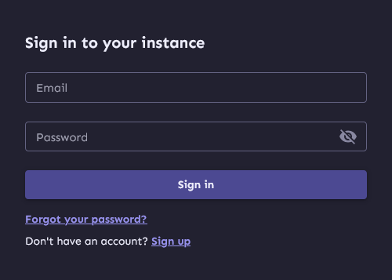

Enter the loging information:
* User: ``admin``
* Password: ``unleash4all``

You should see this homepage:

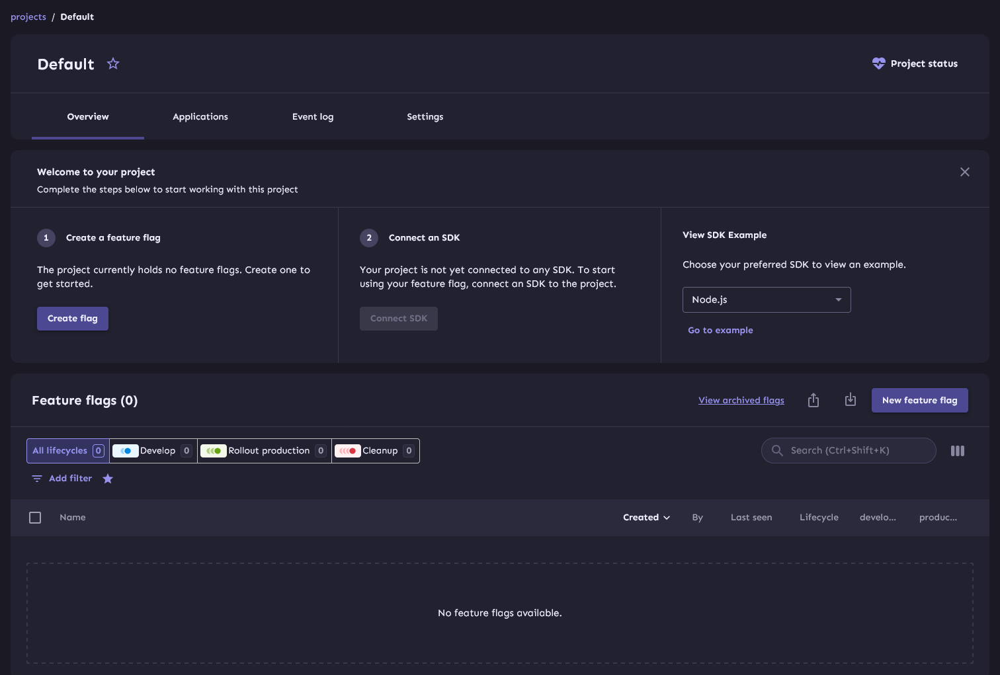

## Create a feature flag

Click to "Go to Project" (or ``Create a feature flag if you have the button on your homepage``).

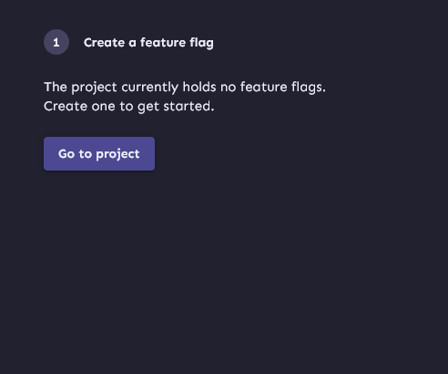

Click to "Create a flag"

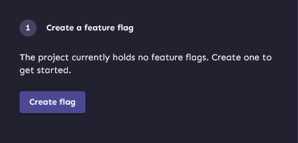

Enter ``discount-enabled`` as the feature flag's name.

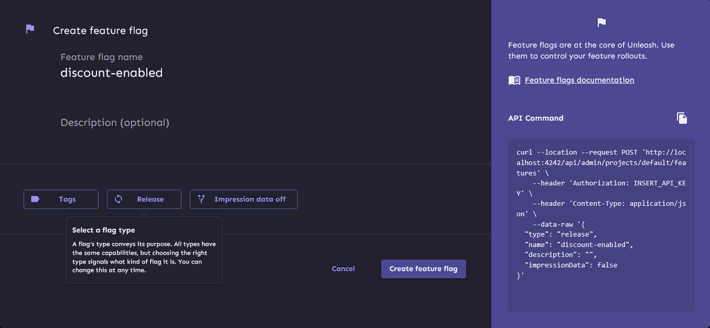

:::info
 ℹ️ When creating a new flag in Unleash, you are prompted to select a **Flag Type**. Unleash provides several flag types out of the box to help categorize and manage the lifecycle of your flags:

 * **Release (Release Toggle)**: Used to enable trunk-based development for teams practicing Continuous Delivery. They allow you to deploy incomplete or untested code to production silently. Their lifespan is typically short (days to weeks).
 * **Experiment (Experiment Toggle)**: Used to perform multivariate or A/B testing. Each user is served a specific variant and tracked to see which variant yields better business metrics. Lifespan: weeks to months.
 * **Operational (Ops Toggle)**: Used to control operational aspects of the system. For instance, you could use an Ops toggle to disable a non-critical feature when your system is under heavy load, or to switch between different database backends. Lifespan: months to years.
 * **Kill Switch**: A specialized Ops toggle intended to quickly turn off a feature that is causing problems in production. Lifespan: permanent or until the underlying issue is resolved.
 * **Permission (Permission Toggle)**: Used to change the features or product experience that certain users receive (e.g., premium users vs. free users, or alpha testers). Lifespan: months to years.

 These types act mostly as metadata in the UI to help teams filter flags and understand their intended purpose and expected lifespan, making it easier to clean up old flags and reduce technical debt over time.
:::

Select **Release** as the flag type and click on ``Create feature flag``.

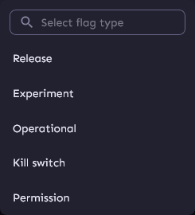

### Enabling the feature flag on the dev environment and test it

Now, let's activate this feature in the development environment.

Click on ``discount-enabled``

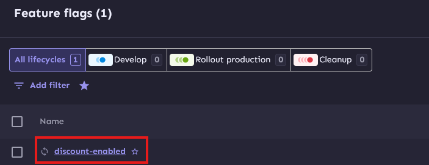

Enable then the development environment:

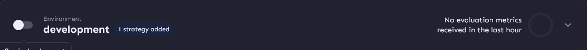

#### Test

First, we need to get our API tokens. Go to the corresponding admin page.

Click on Admin settings:


Then click on ``Access Control>API Access``

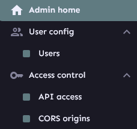

Copy the token to an editor. You will need it several times.

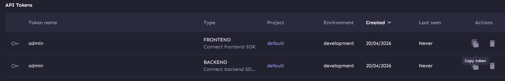

Next, go back to the homepage and select ``Playground``:


Copy paste the API token and click on ``Try configuration``.

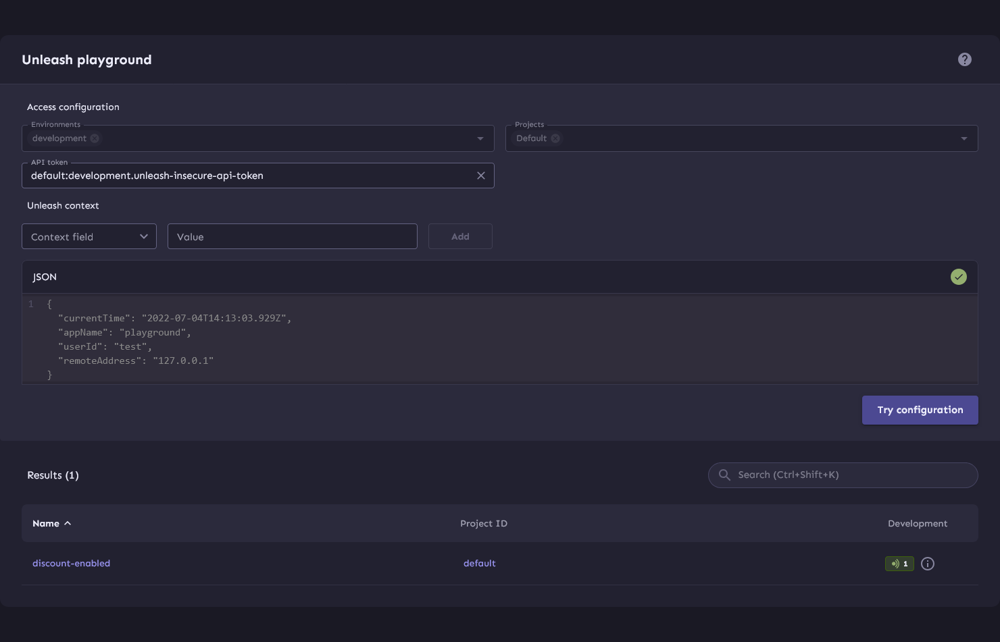

Normally you would get a green box for your newly created feature flag.

Click on the _information_ icon. You would get this content:

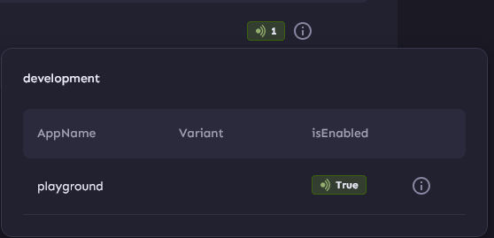

