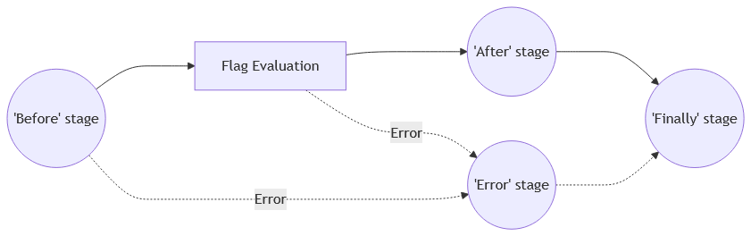
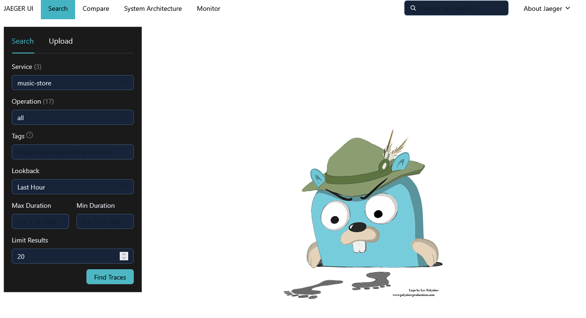
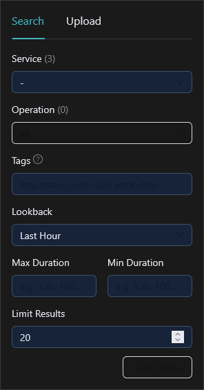
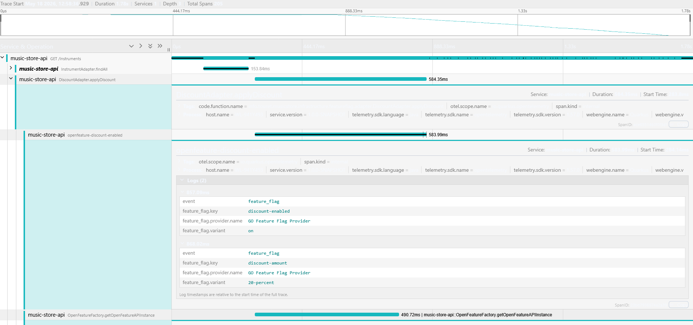

:::info
 ℹ️ What will you do and learn in this chapter?
- Know if the flag causes errors or if it is being used
- Use & create Hooks
:::

# Observability & Hooks

## What are hooks?

ℹ️ Hooks are a mechanism in OpenFeature that allow you to tap into the feature flag evaluation lifecycle. They let you execute custom code at specific points (stages) during a flag evaluation without modifying the core application logic.

The main stages where you can attach hooks are:
- **Before:** Executed before the flag evaluation. Useful for validation or enriching the evaluation context.
- **After:** Executed after a successful flag evaluation. Ideal for logging, observability, and telemetry (e.g., sending analytics events).
- **Error:** Executed if an error occurs during evaluation. Useful for custom error handling or alerting.
- **Finally:** Executed after all other stages, regardless of success or failure. Good for cleanup tasks.

<div style={{textAlign: 'center'}}>



_Source: https://openfeature.dev/specification/sections/hooks/_
</div>


Hooks can be registered at different levels: globally, per-client, or for individual flag invocations.

## Track errors in the API using Hooks

📝 Create a new file ``api/src/main/java/info/touret/musicstore/infrastructure/featureflag/openfeature/ErrorHandlerHook.java`` with the following content:

```java
package info.touret.musicstore.infrastructure.featureflag.openfeature;

import dev.openfeature.sdk.BooleanHook;
import dev.openfeature.sdk.EvaluationContext;
import dev.openfeature.sdk.HookContext;
import org.slf4j.Logger;
import org.slf4j.LoggerFactory;

import java.util.Map;
import java.util.Optional;

public class ErrorHandlerHook implements BooleanHook {
    private static final Logger LOGGER = LoggerFactory.getLogger(ErrorHandlerHook.class);

    @Override
    public Optional<EvaluationContext> before(HookContext<Boolean> ctx, Map<String, Object> hints) {
        LOGGER.info(">>> Before evaluating boolean flag: {}", ctx.getFlagKey());
        return BooleanHook.super.before(ctx, hints);
    }

    @Override
    public void error(HookContext<Boolean> ctx, Exception error, Map<String, Object> hints) {
        LOGGER.error(">>> Unable to process this flag [{}]: {}",ctx.getFlagKey(),error.getMessage());
        BooleanHook.super.error(ctx, error, hints);
    }
}
```

📝 In the method ``getOpenFeatureAPIInstance()`` of the class ``OpenFeatureFactory``, we will globally register this new hook:

```java
@ApplicationScoped
@Produces
public OpenFeatureAPI getOpenFeatureAPIInstance() {
    var openFeatureAPI = OpenFeatureAPI.getInstance();
    openFeatureAPI.addHooks(new ErrorHandlerHook());
    openFeatureAPI.setProviderAndWait(createProvider());
    return openFeatureAPI;
}
```

📝 To simulate an error, we will also comment the declaration of the ``targetingKey`` in the method ``applyDiscount()`` of the class ``DiscountAdapter``:

```java
openFeatureAPIClient.setEvaluationContext(new MutableContext()
                .add("clientCountry", user.country())
//                .add("targetingKey", user.email())
                .add("clientEmail", user.email()));
```

🛠️ If necessary, restart Quarkus:

```bash
./mvnw quarkus:dev
```

🛠️ Run in another terminal this command:

```bash
http :8080/instruments User:'{"firstName":"test","lastName":"user1","email":"user11@musician.com","country":"UK"}' accept:"application/json"
```

👀 You should see these log entries on your console:

```bash
2026-05-05 11:15:37,187 INFO  [info.touret.musicstore.infrastructure.featureflag.openfeature.ErrorHandlerHook] (quarkus-virtual-thread-0) >>> Before evaluating boolean flag: discount-enabled
2026-05-05 11:15:37,187 ERROR [info.touret.musicstore.infrastructure.featureflag.openfeature.ErrorHandlerHook] (quarkus-virtual-thread-0) >>> Unable to process this flag [discount-enabled]: GO Feature Flag requires a targeting key
```

## Use the OpenTelemetry Hook

Analysing the whole feature-flag's process could be tricky. Let's see how [OpenTelemetry](https://opentelemetry.io/) can help us.

:::tip
If you want to know more about observability, feel free to check out [this workshop](https://github.com/worldline/observability-workshop).
:::

### Deploy Jaeger

We need first to add [Jaeger](https://www.jaegertracing.io/) to collect and get a GUI to navigate through traces.

📝 In the file ``api/src/main/docker/compose-devservices.yml``, add the following lines:

```yaml
  jaeger:
    image: jaegertracing/all-in-one:1.76.0
    ports:
      - "16686:16686"
      - "4317:4317"
      - "4318:4318"
      - "14250:14250"
      - "14268:14268"
      - "14269:14269"
      - "9411:9411"
    environment:
      - COLLECTOR_ZIPKIN_HOST_PORT=:9411
    depends_on:
      - go-feature-flag
```

### Configure Go Feature Flag

📝 In the file ``api/src/main/docker/go-feature-flag/proxy.yaml``, add the following configuration lines:

```yaml
otel:
  exporter:
    otlp:
      endpoint: "http://jaeger:4318"
```

### Add Quarkus's OpenTelemetry support

📝 In the ``pom.xml`` file, add the following dependencies:

```xml
<dependency>
    <groupId>io.quarkus</groupId>
    <artifactId>quarkus-opentelemetry</artifactId>
</dependency>
<dependency>
    <groupId>io.opentelemetry</groupId>
    <artifactId>opentelemetry-extension-trace-propagators</artifactId>
</dependency>
```

📝 In the ``api/src/main/resources/application.properties`` file, add the following configuration:

```properties
quarkus.application.name=music-store
quarkus.otel.exporter.otlp.endpoint=http://localhost:4317
quarkus.datasource.jdbc.telemetry=true
```

🛠️ Restart Quarkus:

```bash
./mvnw quarkus:dev
```

### Test

🛠️ Run again K6 to simulate some traffic. In another terminal, run the following command:

```bash
cd ../infrastructure/scripts
k6 run k6-discount-enabled-test.js
```

👀 Go to the port screen, check out the ``16686`` port and click on it to open Jaeger.
You should see this screen:



🛠️ Make some queries on the traces.

🛠️ Select the ``go-feature-flag`` service:



🛠️ Click on "Find Traces".

👀 You could see then the corresponding traces.



:::info
ℹ️ You don't see a whole transaction from Quarkus to Go Feature Flag because the configuration is not downloaded through an API call.
:::
